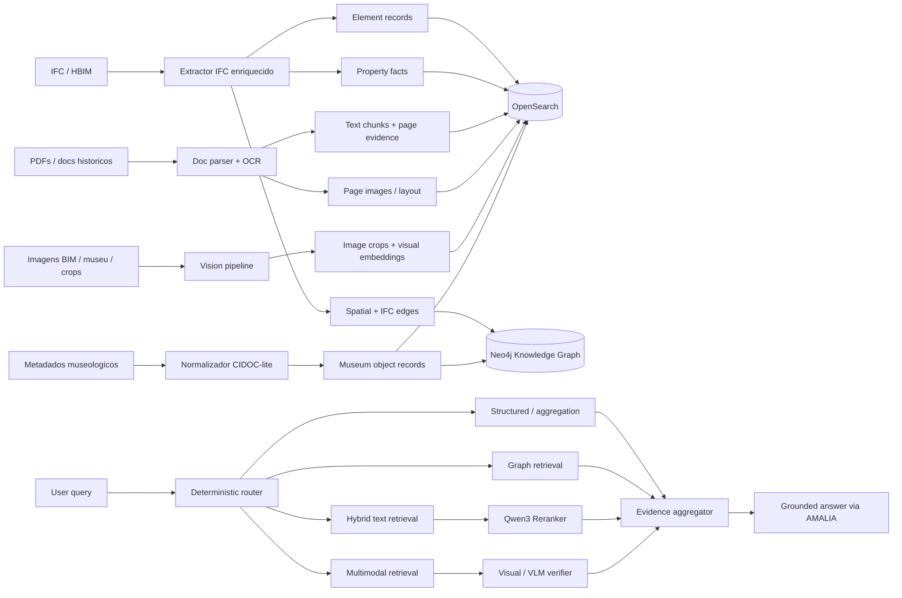
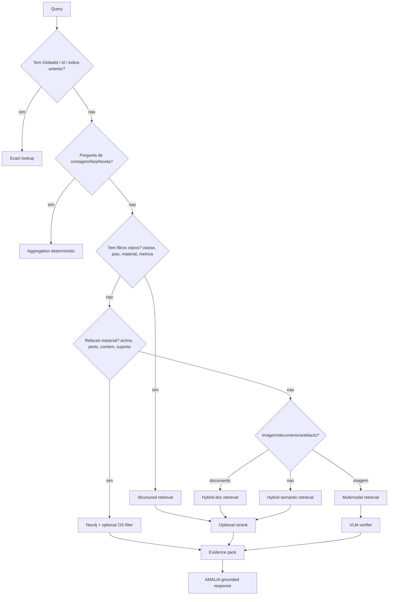

# HBIM RAG — Decisões arquiteturais

## Estado do documento

Este documento regista as decisões arquiteturais estáveis do projeto HBIM RAG.

O seu objetivo é preservar o contexto técnico entre sessões de planeamento e implementação, evitando que decisões fundamentais sejam repetidamente reabertas.

Este documento:

- define a arquitetura-alvo;
- define responsabilidades dos componentes;
- define princípios de segurança, retrieval, grounding e avaliação;
- define contratos conceptuais de dados;
- não substitui o roadmap;
- não substitui as especificações executáveis de cada issue;
- não deve conter passwords, tokens, endpoints reais ou outros valores operacionais.

Os valores de hosts, portas e utilizadores apresentados neste documento são exclusivamente fictícios.

Os valores operacionais reais devem existir apenas no `.env` local ignorado pelo Git ou num secret manager.

**Premissa de hardware:** existe capacidade local com RTX PRO 6000 Blackwell; por isso, as decisões privilegiam qualidade, recall e verificabilidade, sem assumir que todos os modelos ficam residentes simultaneamente.

**Decisão central:** AMALIA permanece como modelo de resposta final e apoio controlado à linguagem natural, mas deixa de ser o componente principal de routing, parsing, filtragem e validação.

## Precedência documental

Quando existir conflito entre documentos, usar esta ordem:

1. especificação da issue ativa;
2. `docs/implementation/IMPLEMENTATION_STATUS.md`;
3. `docs/implementation/ROADMAP.md`;
4. `docs/architecture/HBIM_RAG_DECISIONS.md`;
5. documentação histórica e `README.md`;
6. comportamento legado do código.

Conflitos materiais não devem ser resolvidos silenciosamente. O agente de implementação deve reportá-los antes de alterar a arquitetura.

---

## 1. Contexto observado no repositorio atual

Repositorio: `tjfernandes/DT4SST-CH.BIM_extraction_and_search`.

A pipeline atual faz o seguinte:

1. Extrai elementos IFC com `ifcopenshell`.
2. Gera JSON por elemento BIM.
3. Constroi um `semantic_text` por elemento.
4. Gera um embedding por elemento.
5. Indexa tudo num indice OpenSearch chamado, por defeito, `bim_elements`.
6. Expoe uma API FastAPI `/chat`.
7. Usa LLM para reescrever queries, classificar intencao, extrair classe IFC, filtros, condicoes numericas, query semantica, filtrar resultados e gerar resposta.

Campos atuais principais por elemento:

```text
id
project_id
project_name
ifc_class
name
spatial_hierarchy.storey_name
spatial_hierarchy.storey_id
spatial_hierarchy.parent_element_id
material[]
documents[]
classifications[]
properties{}
quantities{}
metrics.area / volume / height / thickness
semantic_text
semantic_embedding
```

Problemas principais:

1. **Um so indice para demasiados tipos de evidencia.** Um elemento, um PDF, uma pagina, um excerto historico, um crop visual e um artefacto museologico nao devem competir na mesma granularidade.
2. **Um unico vetor por elemento e insuficiente.** Um elemento HBIM pode ter propriedades IFC, documentos, historia, geometria, imagens e metadados museologicos. Um embedding unico dilui tudo.
3. **`properties` e `quantities` dinamicos criam risco de mapping explosion.** Aumentar `mapping.total_fields.limit` adia o problema mas nao o resolve.
4. **Os documentos associados estao pouco pesquisaveis.** Atualmente aparecem como metadados/strings; falta parsing, chunking, pagina, OCR, evidencias e vetor proprio.
5. **Geometria real e relacoes espaciais ainda nao sao first-class citizens.** Existem metricas e hierarquia de piso, mas faltam bounding boxes, centroides, containment, adjacencia, interseccao, orientacao e grafo espacial.
6. **O router RAG depende demasiado do LLM.** Se AMALIA tem baixa fiabilidade, nao deve decidir sozinho filtros, contagens, condicoes, relevancia ou identificacao de resultados.
7. **A filtragem final por LLM pode apagar resultados corretos.** Deve ser substituida por reranking treinado/robusto e validacoes deterministicas.
8. **Ha um problema de seguranca imediato:** remover qualquer password hardcoded de `shared/config.py`. A configuracao deve vir de `.env`/secret manager e ser validada apenas pelos consumidores que dela necessitam. O extractor IFC deve funcionar sem configuracao OpenSearch.

---

## 2. Decisao arquitetural principal

### Decisao assumida

Usar uma arquitetura **OpenSearch + Neo4j + servicos locais de modelos**, mantendo AMALIA apenas como gerador final e, quando necessario, como componente opcional de explicacao.

```text
OpenSearch = retrieval textual, lexical, vetorial, multimodal e agregacoes simples
Neo4j      = relacoes IFC, espaciais, historicas, elemento-documento-artefacto
GPU local  = embeddings, rerankers, OCR/doc parsing, VLMs e matching visual
AMALIA     = resposta final grounded, nunca fonte de verdade
```

### Porque nao OpenSearch puro?

OpenSearch deve continuar a ser o motor principal de pesquisa porque ja esta no projeto e suporta filtros, BM25, kNN, hybrid search, aggregations e nested fields. No entanto, relacoes como `elemento A esta acima de B`, `porta pertence a parede`, `artefacto esta associado visualmente a capitel X`, `documento menciona sala Y` e `elemento tem caminho espacial edificio > piso > compartimento` tornam-se mais fiaveis num grafo.

### Alternativas aceites

- **V1 mais rapida:** OpenSearch apenas + indice `hbim_edges_v1` para relacoes materializadas.
- **V1 robusta recomendada:** OpenSearch + Neo4j.
- **Escala muito grande / multi-vector real:** OpenSearch + Neo4j + Vespa ou Qdrant para retrieval visual/late-interaction. Nao implementar ja, a menos que ColQwen/ColPali multi-vector seja requisito central.

### Segurança e configuração

As definições devem ser segmentadas por consumidor.

Regras obrigatórias:

- `OPENSEARCH_VERIFY_CERTS` tem default seguro `true`;
- um ambiente específico pode definir `false` explicitamente;
- quando `OPENSEARCH_USE_SSL` não está definido, SSL é inferido apenas a partir do scheme;
- a existência de username ou password nunca determina SSL;
- o extractor IFC não instancia nem valida configuração OpenSearch;
- API e indexadores validam OpenSearch apenas quando criam ou usam o cliente;
- nenhum cliente OpenSearch, Neo4j, LLM ou serviço de modelos é criado durante imports;
- secrets usam tipos próprios, como `SecretStr`, e nunca aparecem em `repr`, logs ou erros;
- testes automatizados usam apenas valores sintéticos e nunca contactam serviços remotos;
- `.env.example` contém apenas valores fictícios e secrets vazios.

---

## 3. Diagrama da pipeline proposta



---

## 4. Indices OpenSearch decididos

### 4.1 `hbim_elements_v2`

Um documento por elemento BIM. Serve para pesquisa rapida, filtros, facetas, contagens e ligacao a evidencia.

Campos decididos:

```yaml
id: keyword                    # GlobalId normalizado
project_id: keyword
project_name: text + keyword
ifc_class: keyword
name: text + keyword
name_normalized: keyword
semantic_label: text           # labels humanos: porta, parede, capitel, arco, etc.
materials: keyword[]
material_text: text
storey_id: keyword
storey_name: keyword
space_id: keyword              # se existir IfcSpace
space_name: keyword
parent_element_id: keyword
classification_codes: keyword[]
classification_text: text
metrics:
  area: double
  volume: double
  height: double
  thickness: double
geometry:
  has_geometry: boolean
  bbox_min: double[3]
  bbox_max: double[3]
  centroid: double[3]
  footprint_area: double
  orientation: keyword
relations_summary:
  contained_in: keyword[]
  adjacent_to: keyword[]
  supports: keyword[]
  hosted_by: keyword[]
evidence_refs:
  chunk_ids: keyword[]
  document_ids: keyword[]
  media_ids: keyword[]
  museum_object_ids: keyword[]
element_text: text             # curto, controlado, sem despejar tudo
embedding_qwen3: knn_vector
embedding_model: keyword
embedding_dimension: integer
embedding_version: keyword
updated_at: date
```

**Decisao:** nao guardar todas as propriedades IFC dinamicas aqui como campos OpenSearch. Guardar apenas propriedades normalizadas e frequentemente consultadas. O resto vai para `hbim_property_facts_v1`.

---

### 4.2 `hbim_property_facts_v1`

Um documento por propriedade/quantidade/classificacao atomica.

```yaml
fact_id: keyword
project_id: keyword
element_id: keyword
ifc_class: keyword
pset: keyword
property_name: keyword
property_name_norm: keyword
value_raw: keyword
value_text: text
value_number: double
unit: keyword
value_type: keyword             # string | number | bool | date | enum
source: keyword                 # pset | qto | classification | museum | inferred
confidence: float
```

Usar este indice para:

- perguntas sobre propriedades raras;
- filtros numericos;
- auditoria de valores;
- evitar mapping explosion;
- criar facetas dinamicas por `pset.property_name`.

---

### 4.3 `hbim_chunks_v1`

Um documento por chunk textual. Inclui chunks de PDF, relatorios historicos, metadados museologicos, descricoes longas e excertos derivados de IFC.

```yaml
chunk_id: keyword
project_id: keyword
source_type: keyword       # ifc_semantic | pdf | historical_text | museum | notes | generated_caption
source_id: keyword
document_id: keyword
page: integer
section_title: text
element_ids: keyword[]
museum_object_ids: keyword[]
text: text
text_exact: keyword
language: keyword
bbox_on_page: object
embedding_qwen3: knn_vector
embedding_model: keyword
embedding_dimension: integer
embedding_version: keyword
sparse_features: rank_features  # opcional para neural sparse
created_by: keyword             # parser/model/version
confidence: float
```

**Decisao:** todo documento associado a um elemento deve criar chunks independentes. O elemento so referencia os chunks.

---

### 4.4 `hbim_media_v1`

Um documento por imagem, pagina rasterizada, crop de elemento, fotografia museologica ou crop detectado.

```yaml
media_id: keyword
project_id: keyword
source_type: keyword        # bim_render | pdf_page | museum_image | crop | scan | ortho_photo
source_id: keyword
element_ids: keyword[]
museum_object_ids: keyword[]
page: integer
image_uri: keyword
crop_bbox: object
caption: text
visual_tags: keyword[]
image_embedding_jina_clip_1024: knn_vector
caption_embedding_qwen3: knn_vector
embedding_model: keyword
embedding_dimension: integer
embedding_version: keyword
visual_hash: keyword
perceptual_hash: keyword
quality_score: float
```

Usar para:

- texto -> imagem;
- imagem -> imagem;
- artefacto museu -> elemento BIM;
- pagina PDF visual -> query textual;
- validacao visual com VLM.

---

### 4.5 `hbim_documents_v1`

Um documento por documento fonte.

```yaml
document_id: keyword
project_id: keyword
uri: keyword
title: text + keyword
document_type: keyword     # report | drawing | inventory | article | scan | pdf | image
language: keyword
pages: integer
linked_element_ids: keyword[]
linked_museum_object_ids: keyword[]
parser: keyword
ocr_model: keyword
checksum: keyword
created_at: date
```

---

### 4.6 Neo4j: grafo `hbim_kg`

Nos e relacoes:

```text
(:Project)
(:Building)
(:Storey)
(:Space)
(:Element {global_id, ifc_class})
(:Material)
(:Document)
(:Chunk)
(:MuseumObject)
(:Image)
(:Period)
(:Person)
(:Place)

(Project)-[:HAS_BUILDING]->(Building)
(Building)-[:HAS_STOREY]->(Storey)
(Storey)-[:HAS_SPACE]->(Space)
(Space)-[:CONTAINS]->(Element)
(Element)-[:HAS_MATERIAL]->(Material)
(Element)-[:HAS_DOCUMENT]->(Document)
(Document)-[:HAS_CHUNK]->(Chunk)
(Element)-[:VISUALLY_MATCHES {score, model, evidence}]->(MuseumObject)
(Element)-[:ADJACENT_TO]->(Element)
(Element)-[:ABOVE|BELOW|INTERSECTS|HOSTED_BY|VOIDS|FILLS]->(Element)
(Element)-[:MENTIONED_IN]->(Chunk)
(MuseumObject)-[:DEPICTS|FOUND_IN|DATED_TO]->(...)
```

**Decisao:** Neo4j e fonte de verdade para relacoes; OpenSearch guarda `relations_summary` so para filtros e snippets rapidos.

**Pipeline de extracao do grafo (em avaliacao).** Como este grafo sera
construido a partir do IFC ainda **nao esta decidido**. O TopologicPy e um
**candidato** a motor de topologia/relacoes (import IFC, grafo de relacoes IFC,
relacoes espaciais derivadas), avaliado na ADR proposta
`ADR-0001-TOPOLOGICPY-IFC-GRAPH-PIPELINE.md` (estado **Proposed**). As
seguintes decisoes ja aceites mantem-se **intactas** e limitam qualquer
adocao: o **IfcOpenShell** continua o parser IFC autoritativo e a unica fonte de
identidade IFC (`GlobalId`); o **schema canonico** e os IDs canonicos continuam
o contrato de ingestao; o **Neo4j continua a fonte de verdade das relacoes**,
escrito por um writer proprio do projeto com o schema `hbim_kg` acima — nunca
por um upsert de grafo generico. Qualquer biblioteca terceira fica **atras de um
adapter**, produzindo um **IR canonico de grafo** propriedade do projeto; os
seus objetos nunca sao o contrato persistido. Relacoes **nativas IFC** e
**derivadas por geometria** permanecem distinguiveis, com proveniencia,
algoritmo, versao e tolerancia por aresta. A adocao final esta **condicionada ao
benchmark de HBIM-079**; nenhuma selecao e assumida antes desse artefacto de
decisao.

---

## 5. Modelos decididos para GPU local

A RTX PRO 6000 Blackwell tem 96 GB GDDR7 ECC, 5a geracao de Tensor Cores e largura de banda ~1.8 TB/s, por isso a stack deve usar modelos grandes quando isso aumentar qualidade.

### 5.1 Embeddings textuais

**Modelo principal:** `Qwen/Qwen3-Embedding-8B`.

A dimensão não fica fixada globalmente em 4096.

Deve ser escolhida separadamente por tipo de índice através de benchmark.

Dimensões candidatas:

```text
1024
2048
4096
```

A decisão deve considerar:

- Recall@k;
- nDCG@k;
- MRR, quando aplicável;
- latência p50 e p95;
- tamanho do índice;
- memória usada pelo índice vetorial;
- tempo de indexação;
- throughput de ingestão.

Deve ser escolhida a menor dimensão que mantenha a qualidade dentro da tolerância definida no gold set.

É permitido que `hbim_elements`, `hbim_chunks` e captions usem dimensões diferentes.

A dimensão vencedora deve ficar registada:

- no mapping;
- na configuração;
- no relatório de benchmark;
- nos metadados do embedding.

Motivos para manter Qwen3-Embedding-8B:

- forte desempenho multilingual;
- adequado a português, inglês e terminologia técnica;
- contexto longo;
- suporte a instruções de retrieval;
- substituto do embedding atual;
- suporte a truncagem Matryoshka para comparar dimensões.

Configuração conceptual:

```env
EMBEDDING_MODEL_NAME=Qwen/Qwen3-Embedding-8B

ELEMENT_EMBEDDING_DIM=2048
CHUNK_EMBEDDING_DIM=2048
CAPTION_EMBEDDING_DIM=1024

EMBEDDING_BATCH_SIZE=8
EMBEDDING_DTYPE=bfloat16
EMBEDDING_SERVICE_URL=http://embeddings.example.test
```

Os valores de dimensão acima são apenas exemplos. A decisão real depende do benchmark.

O modelo deve ser servido num processo próprio. API e indexadores chamam o serviço através de um cliente comum; não carregam `SentenceTransformer` separadamente dentro de cada processo.

### 5.2 Reranker textual

**Modelo principal:** `Qwen/Qwen3-Reranker-8B`.

Uso:

- rerank top 100-300 candidatos vindos de BM25+dense;
- substituir `FILTER_RESULTS_BATCH` baseado em LLM;
- produzir score deterministico e auditable;
- aplicar prompts/instrucoes de retrieval especificos para HBIM.

### 5.3 Sparse / lexical

**Decisao:** manter BM25 sempre ativo. Adicionar neural sparse apenas depois da V1.

Prioridade:

1. BM25 + filtros estruturados.
2. Dense Qwen3.
3. Hybrid fusion.
4. Opcional: neural sparse OpenSearch ou BGE-M3 externo.

### 5.4 Document parsing / OCR

**Modelo principal:** `PaddleOCR-VL-1.6` quando disponivel localmente; fallback `PaddleOCR-VL-1.5/0.9B`.

Uso:

- PDFs digitalizados;
- documentos com tabelas;
- relatorios historicos;
- plantas com texto;
- captions e metadados visuais.

**Complemento recomendado:** `Docling` para pipeline de conversao, estrutura, Markdown/JSON, leitura de ordem, tabelas e integracao operacional.

### 5.5 Retrieval visual e multimodal

**Modelo principal para imagem-texto geral:** `jinaai/jina-clip-v2`, 1024 dimensoes.

**Modelo opcional para paginas PDF visualmente complexas:** `ColQwen2.5` ou familia ColPali, quando a query depender de layout, plantas, tabelas ou paginas renderizadas.

**Verificador visual default:** `Qwen3-VL-8B-Instruct` em FP8.

**Escalonamento para casos dificeis:** `Qwen3-VL-32B-Instruct` em FP8/AWQ.

Regras:

- o VLM nao e um retriever;
- retrieval e ranking visual usam embeddings e, quando justificado, late interaction;
- o VLM entra apenas depois da geracao de candidatos;
- antes do VLM existe um gate deterministico de metadados;
- candidatos com conflitos de material, periodo, dimensoes ou proveniencia devem ser descartados antes da verificacao;
- o modelo de 32B e usado apenas quando o 8B sinaliza incerteza ou quando e necessaria leitura visual/OCR mais exigente;
- a janela do modelo de 32B pode ser exclusiva, colocando embedder e reranker em sleep;
- o modelo concreto permanece parametrizavel por configuracao;
- confirmar a disponibilidade e compatibilidade do checkpoint no momento da implementacao.

Usos:

- texto -> imagem de artefacto;
- imagem de museu -> crop BIM/render;
- pagina PDF -> pergunta textual;
- verificacao de match visual antes de criar uma relacao `VISUALLY_MATCHES`;
- leitura grounded de paginas ou imagens recuperadas.

Nenhum `VISUALLY_MATCHES` pode ser criado sem:

- score de similaridade;
- modelo e versao;
- threshold calibrado;
- ausencia de conflito deterministico;
- evidencia associada;
- resultado do verifier.

### 5.6 Entity linking e normalizacao

**Decisao:** primeiro regras e dicionarios, depois LLM.

Componentes:

- dicionario PT/EN de classes IFC;
- gazetteer de materiais historicos;
- thesaurus de elementos arquitetonicos;
- entidades museologicas normalizadas;
- normalizacao Unicode/acento/singular/plural;
- fuzzy matching deterministico para nomes e ids;
- VLM/LLM apenas para casos nao resolvidos ou para sugerir candidatos.

---

## 6. Router RAG decidido: deterministic first

O router deve ser uma funcao Python testavel. AMALIA nao deve classificar a query no caminho principal.



### Regras deterministicas iniciais

```python
if contains_global_id(query) or references_previous_result(query):
    route = "exact_lookup"
elif asks_count_or_distinct(query):
    route = "aggregation"
elif has_numeric_condition(query) or has_ifc_class(query) or has_storey(query) or has_material(query):
    route = "structured_or_hybrid_prefilter"
elif has_spatial_relation_terms(query):
    route = "graph"
elif mentions_image_artifact_visual_terms(query) or input_has_image:
    route = "multimodal"
elif mentions_document_terms(query):
    route = "document_hybrid"
else:
    route = "hybrid_semantic"
```

Termos de routing:

```yaml
aggregation:
  - quantos
  - contar
  - lista de materiais
  - quais pisos
  - distribuicao
  - por piso
  - por material
structured:
  - porta, portas, janela, parede, viga, pilar, escada, laje
  - piso, andar, storey
  - material de, betao, madeira, pedra, calcario, tijolo
  - maior que, menor que, acima de X metros
spatial_graph:
  - acima, abaixo, adjacente, perto, dentro, contem, suporta, ligado a
  - pertence a, esta em, abre para, comunica com
multimodal:
  - parecido com, visualmente semelhante, fotografia, imagem, artefacto
  - acervo, museu, decoracao, ornamento, escultura, capitel
historical_document:
  - documento, pdf, relatorio, fonte, pagina, menciona, historia, epoca, seculo
```

### Onde AMALIA ainda entra

AMALIA pode:

- reescrever follow-ups conversacionais quando o contexto anterior e necessario;
- gerar resposta final com citacoes internas;
- explicar evidencias;
- fazer query expansion opcional depois do router deterministico;
- sugerir sinonimos, mas nunca aplicar filtros sem validacao.

AMALIA nao deve:

- decidir contagens;
- validar se um elemento existe;
- filtrar resultados finais;
- inventar relacoes espaciais;
- criar matches visuais sem score/modelo/evidencia.

---

## 7. Retrieval por tipo de pergunta

### 7.1 Elemento especifico

Exemplos:

- "mostra o elemento `2hJ...`"
- "detalha o primeiro"
- "que documentos tem esta parede?"

Pipeline:

1. Resolver id exato ou referencia a resultado anterior.
2. Buscar `hbim_elements_v2`.
3. Expandir evidencias: chunks, documentos, imagens, propriedades e relacoes Neo4j.
4. Gerar resposta grounded.

Nao usar kNN.

---

### 7.2 Filtros estruturados

Exemplos:

- "paredes de pedra no piso 1"
- "vigas com mais de 5 metros"
- "portas em madeira"

Pipeline:

1. Regex/dicionario para classe IFC.
2. Extracao deterministica de material, piso e condicoes numericas.
3. Query OpenSearch com `filter` e `range`.
4. BM25 opcional se existir texto livre.
5. Reranker apenas se muitos resultados.

Usar lexical/filtros, nao dense como primeira opcao.

---

### 7.3 Contagens, listas e facetas

Exemplos:

- "quantas portas ha por piso?"
- "quais materiais existem nas paredes?"

Pipeline:

1. Router `aggregation`.
2. OpenSearch aggregations ou Neo4j count.
3. Resposta tabelada.

Nao usar LLM para calcular.

---

### 7.4 Relacoes espaciais

Exemplos:

- "o que suporta o telhado?"
- "que elementos estao adjacentes a esta parede?"
- "que artefactos estao na sala X?"

Pipeline:

1. Resolver entidades alvo.
2. Consultar Neo4j.
3. Se relacao nao existir, calcular offline via geometria e indexar edge.
4. Responder com caminhos grafo + evidencias.

Usar graph retrieval. Dense so para encontrar entidades mencionadas vagamente.

---

### 7.5 Historia e documentos

Exemplos:

- "que elementos tem mencoes do seculo XVI?"
- "onde e que o relatorio fala da capela?"

Pipeline:

1. Buscar `hbim_chunks_v1` com hybrid BM25 + Qwen3 dense.
2. Rerank com Qwen3-Reranker-8B.
3. Agrupar por elemento/documento/pagina.
4. Expandir ligacoes no KG.
5. Responder com citacao de documento, pagina e chunk.

Usar hybrid + reranker.

---

### 7.6 Artefactos do museu e matching visual

Exemplos:

- "ha algum elemento BIM parecido com esta peca do museu?"
- "que artefactos podem corresponder a este capitel?"

Pipeline:

1. Gerar embeddings de imagem para artefacto e crops/render BIM.
2. Recuperar candidatos por `image_embedding_jina_clip_1024`.
3. Se a query for textual, fazer text -> image retrieval.
4. Validar top candidatos com VLM ou modelo visual especializado.
5. Criar ou sugerir relacao `VISUALLY_MATCHES` com score, modelo, versao e explicacao.
6. Nunca assumir match definitivo sem limiar e evidencia visual.

Usar multimodal retrieval + VLM verifier.

---

### 7.7 Imagens e paginas PDF

Exemplos:

- "nesta planta, onde esta a entrada?"
- "que pagina mostra a fachada principal?"

Pipeline:

1. Rasterizar paginas PDF.
2. Indexar imagens de pagina em `hbim_media_v1`.
3. Usar ColQwen/ColPali para visual document retrieval se layout for importante.
4. OCR/Docling/PaddleOCR para texto estruturado.
5. VLM apenas para interpretar os poucos candidatos finais.

---

## 8. Estrategia de ranking

### Candidate generation

Usar sempre mais de uma fonte quando a query nao for puramente estruturada:

```text
BM25 top 200
Qwen3 dense top 200
filters / KG candidates
visual candidates top 100, quando aplicavel
```

### Fusion

Decisao V1:

```text
RRF - Reciprocal Rank Fusion
```

Por ser simples, robusto e menos sensivel a escalas de score.

Decisao V2:

```text
OpenSearch hybrid search pipeline com normalizacao + pesos ajustados por tipo de query
```

Pesos iniciais:

```yaml
structured_with_text:
  bm25: 0.65
  dense: 0.25
  graph_boost: 0.10
historical_semantic:
  bm25: 0.35
  dense: 0.50
  graph_boost: 0.15
material_or_ifc_exact:
  filters: mandatory
  bm25: 0.70
  dense: 0.20
  graph_boost: 0.10
visual_artifact:
  image_vector: 0.60
  caption_dense: 0.20
  metadata_bm25: 0.20
```

### Reranking

1. Qwen3-Reranker-8B para texto.
2. VLM verifier para pares imagem/elemento ou imagem/artefacto.
3. Regras deterministicas para thresholds:

```yaml
accept_text_evidence_if:
  reranker_score: ">= tuned_threshold"
  source_has_id: true
accept_visual_match_if:
  image_similarity: ">= tuned_threshold"
  vlm_verifier: "match or probable_match"
  metadata_conflict: false
```

---

## 9. Grounding e fiabilidade

A resposta final deve ser gerada apenas a partir de um `EvidencePack` estruturado.

```yaml
EvidencePack:
  query: string
  route: string
  deterministic_filters: {}
  result_count: int
  evidence_items:
    - evidence_id
      source_type
      source_id
      element_id
      document_id
      page
      text_excerpt
      score
      retrieval_method
      confidence
  graph_paths:
    - nodes
      relationships
      confidence
  caveats:
    - missing_geometry
    - inferred_relation
    - visual_match_not_confirmed
```

AMALIA recebe apenas este pacote e uma instrucao forte:

```text
Responde apenas com base no EvidencePack.
Se a evidencia nao suportar uma afirmacao, diz que nao ha evidencia suficiente.
Nao inventes nomes, datas, materiais, relacoes espaciais ou matches visuais.
Inclui sempre ids de elemento/documento/pagina quando existirem.
```

---

## 10. Mudancas concretas no repositorio

### Nova estrutura recomendada

```text
backend/
  ingestion/
    ifc_extractor.py
    geometry_extractor.py
    document_ingestor.py
    image_ingestor.py
    museum_ingestor.py
    kg_builder.py
    indexers/
      elements_indexer.py
      property_facts_indexer.py
      chunks_indexer.py
      media_indexer.py
      documents_indexer.py
  retrieval/
    router.py
    query_parser.py
    lexical.py
    dense.py
    hybrid.py
    graph.py
    multimodal.py
    rerank.py
    evidence.py
  models/
    embeddings_qwen3.py
    reranker_qwen3.py
    ocr_paddle.py
    vlm_verifier.py
  api/
    main.py
    schemas.py
    responses.py
  shared/
    config.py
    opensearch.py
    neo4j.py
    logging.py
    security.py
  tests/
    test_router.py
    test_query_parser.py
    test_index_mappings.py
    test_retrieval_structured.py
    test_evidence_pack.py
```

### Prioridade de implementacao

#### Fase 0 - seguranca e baseline

1. Remover password hardcoded.
2. Criar `.env.example` sem segredos.
3. Introduzir settings segmentadas com Pydantic.
4. Garantir que nenhum cliente de rede e criado durante imports.
5. Criar testes minimos para configuracao.
6. Capturar o baseline do sistema atual antes de alterar retrieval, embeddings ou indices.

#### Fase 1 - indices novos sem multimodal

1. Criar mappings para `hbim_elements_v2`, `hbim_property_facts_v1`, `hbim_chunks_v1`, `hbim_documents_v1`.
2. Refatorar extractor para emitir records separados.
3. Trocar embedding para Qwen3-Embedding-8B e executar benchmark 1024/2048/4096 por indice.
4. Criar migration script: IFC -> normalized records -> OpenSearch.
5. Implementar router deterministico para exact/aggregation/structured/hybrid.

#### Fase 2 - reranking e EvidencePack

1. Integrar Qwen3-Reranker-8B.
2. Remover filtragem por LLM dos resultados.
3. Criar `EvidencePack`.
4. Alterar prompt de AMALIA para grounded answering.
5. Guardar scores e metodos de retrieval no output.

#### Fase 3 - documentos historicos

1. Ingestao de PDFs com Docling + PaddleOCR-VL.
2. Chunking por secao/pagina.
3. Ligacao chunk -> elemento via documentos IFC, menções de GlobalId, nomes, localizacao e entity linking.
4. Hybrid retrieval em documentos.

#### Fase 4 - grafo

1. Criar Neo4j.
2. Indexar relacoes IFC nativas.
3. Adicionar relacoes espaciais derivadas de geometria.
4. Implementar retrieval por Cypher.
5. Usar grafo para expandir evidencias.

#### Fase 5 - multimodal e museu

1. Ingerir imagens do museu e metadados.
2. Gerar embeddings `jina-clip-v2`.
3. Gerar renders/crops de elementos BIM relevantes.
4. Criar matching visual candidato.
5. Validar com VLM.
6. Criar relacoes `VISUALLY_MATCHES` com scores, thresholds e versoes de modelo.

---

## 11. Decisoes finais para o Claude transformar em plano

1. **Manter OpenSearch**, mas deixar de ter um indice monolitico.
2. **Adicionar Neo4j** para relacoes IFC, espaciais, documentais e museologicas.
3. **Substituir o embedding atual por Qwen3-Embedding-8B e selecionar a dimensao por indice atraves de benchmark entre 1024, 2048 e 4096.**
4. **Adicionar Qwen3-Reranker-8B** e remover filtragem final por LLM.
5. **Implementar router deterministico antes de qualquer LLM.**
6. **Separar elementos, propriedades, chunks, documentos e media em indices proprios.**
7. **Tratar documentos PDF como evidencia propria**, nao como metadado do elemento.
8. **Tratar imagens e artefactos como evidencias multimodais**, com embeddings e validacao visual.
9. **AMALIA so responde com EvidencePack**, nao decide factos.
10. **Todas as respostas devem devolver ids, fontes e scores**, para debug e confianca.
11. **Implementar por fases**, com testes do router e de retrieval antes de multimodal.
12. **Nao usar parent-child OpenSearch como default.** Preferir indices separados + ids + Neo4j. Parent-child so se for absolutamente necessario e medido.
13. **Usar nested so onde a relacao interna precisa de ser preservada**, por exemplo classificacoes pequenas. Para propriedades arbitrarias, usar fact table.
14. **Usar kNN apenas quando a query e semantica/visual/documental.** Para IDs, contagens, pisos, materiais e metricas, usar filtros deterministicas.
15. **Criar avaliacao offline antes das alteracoes de retrieval**, capturar o baseline atual e expandir progressivamente as queries gold: structured, semantic, historical, spatial, document e visual.

---

## 12. Fontes tecnicas consultadas

- Repositorio analisado: `tjfernandes/DT4SST-CH.BIM_extraction_and_search`.
- NVIDIA RTX PRO 6000 Blackwell: 96 GB GDDR7 ECC, Tensor Cores 5a geracao, ~1.8 TB/s bandwidth.
- Qwen3 Embedding / Reranker model cards: embeddings 8B, reranker 8B, contexto 32k, multilingual, instruction-aware.
- OpenSearch docs: hybrid search, kNN/vector search, nested fields, neural sparse, join/parent-child performance caveats.
- Jina CLIP v2 model card: multilingual multimodal image/text embeddings, 1024 dims, 512x512 image input.
- Hugging Face ColQwen/ColPali docs: visual document retrieval por late interaction.
- PaddleOCR-VL papers/docs: parsing documental multilingual com VLM compacto.
- IBM Docling docs: conversao de documentos para JSON/Markdown preservando layout, tabelas e reading order.
